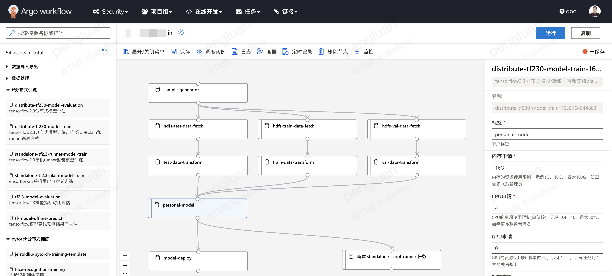
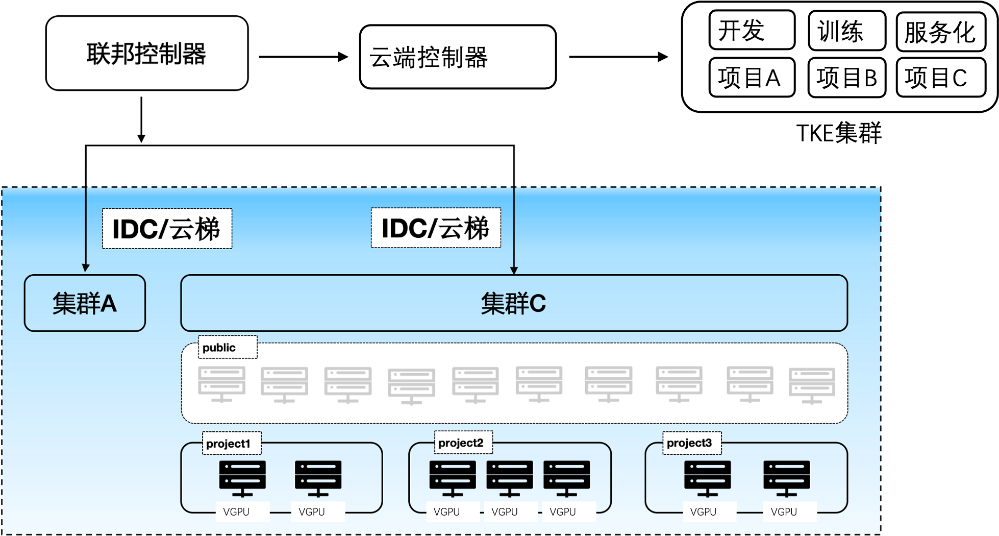
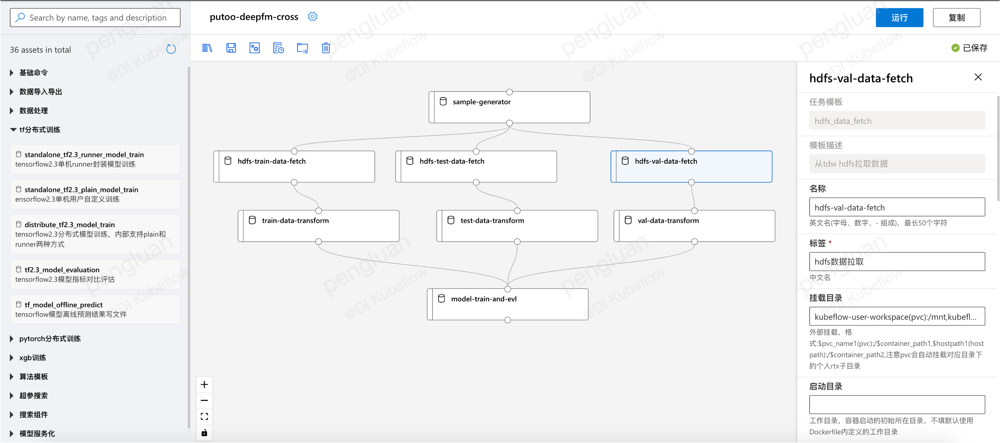

# argo dashboard
argo dashboard是由TME研发的云原生argo pipeline编排。基于argo的云原生调度，包含项目管理，在线notebook，在线镜像构建，拖拉拽编排pipeline，定时调度，实例管理。

平台完成部署之后如下:

# 开源共建

有意向进行开源共建的同学请微信添加767065521并备注"开源共建"进入微信群.

# 功能简述

### 多集群管控

cube支持多集群调度，可以由一个web平台管控多个训练或推理集群。在不同项目组下配置当前项目组使用的集群名，然后在用户训练或部署推理时，指定对应项目组即可。

### 分布式存储

cube会自动为用户挂载用户个人目录，同一个用户在平台任何地方启动的容器目录下/mnt/$username均为用户个人子目录。可以将pvc/hostpath/memory/configmap等挂载成容器目录。同时可以在项目组中配置项目组的默认挂载，进而实现一个项目组共享同一个目录等功能。

### 在线开发

支持在线jupyterlab/theia(vscode)等功能，多用户，多实例，支持cpu/gpu版本。另外支持在线构建docker镜像，免除算法同学docker学习成本

### 拖拉拽pipeline编排

支持单任务调试、分布式任务日志聚合查看，pipeline调试跟踪，任务运行资源监控，以及定时调度功能(包含补录，忽略，重试，依赖，并发限制，过期淘汰等功能)

### 功能模板化

为了避免重复开发，对pipeline中的task功能进行模板化开发。平台开发者或用户可自行开发模板镜像，将镜像注册到平台，这样其他用户就可以复用这些功能。平台自带模板在job-template目录下

# 平台部署

参考install/README.md

